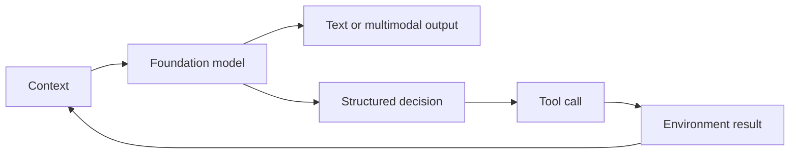

# Foundations

- [[01 Foundations/What Is an LLM]] — tokens, prediction, model families, multimodality, and limits.
- [[01 Foundations/Context Windows and Inference]] — context as temporary working memory, sampling, reasoning, and cost.
- [[01 Foundations/Local AI Hardware and Inference]] — model fit, VRAM, unified memory, bandwidth, quantization, and platform choice.
- [[01 Foundations/Inference Engines and Serving]] — engines, prefill vs decode, continuous batching, paged attention, and speculative decoding.
- [[01 Foundations/KV Cache and Long-Context Costs]] — the KV cache as the dominant long-context cost and the stack that cuts it.
- [[01 Foundations/Test-Time Compute and Reasoning Models]] — spending compute at inference time; reasoning models and effort budgets.
- [[01 Foundations/Structured Outputs and Tool Calling]] — turning model decisions into software actions.
- [[01 Foundations/Fine-Tuning Decision Framework]] — when retrieval, tools, prompting, or adapters solve the actual gap.
- [[03 Context Knowledge Memory/Context Engineering]] — the next layer after prompting.

In plain terms: you send context to the model, it produces either freeform text or a structured decision, that decision can invoke a real tool, the tool's result feeds back into the next round of context, and the loop continues. Everything below this hub is about making that loop faster, safer, and more capable.

## Recommended reading order

Start with the conceptual foundations, then move to the practical hardware and adaptation decisions:

- [[01 Foundations/What Is an LLM]] — what a model is and is not
- [[01 Foundations/Context Windows and Inference]] — how context and sampling work
- [[01 Foundations/Structured Outputs and Tool Calling]] — turning model output into software actions
- [[01 Foundations/Local AI Hardware and Inference]] — where and on what hardware to run models
- [[01 Foundations/Inference Engines and Serving]] — what the serving stack does between model and user
- [[01 Foundations/KV Cache and Long-Context Costs]] — why long context is expensive and how to cut it
- [[01 Foundations/Test-Time Compute and Reasoning Models]] — reasoning models and effort budgets
- [[01 Foundations/Fine-Tuning Decision Framework]] — when training is the right lever vs retrieval or prompting

## Where next

Once the foundations are solid, move to the layer that composes models into systems: [[02 Agents and Harnesses/Agents and Harnesses Hub]].

---

---

> **← [[00 Start Here/Conversation Coverage|Conversation Coverage]]** · **[[AI_Home|Home]]** · **[[01 Foundations/What Is an LLM|What Is an LLM]] →**
