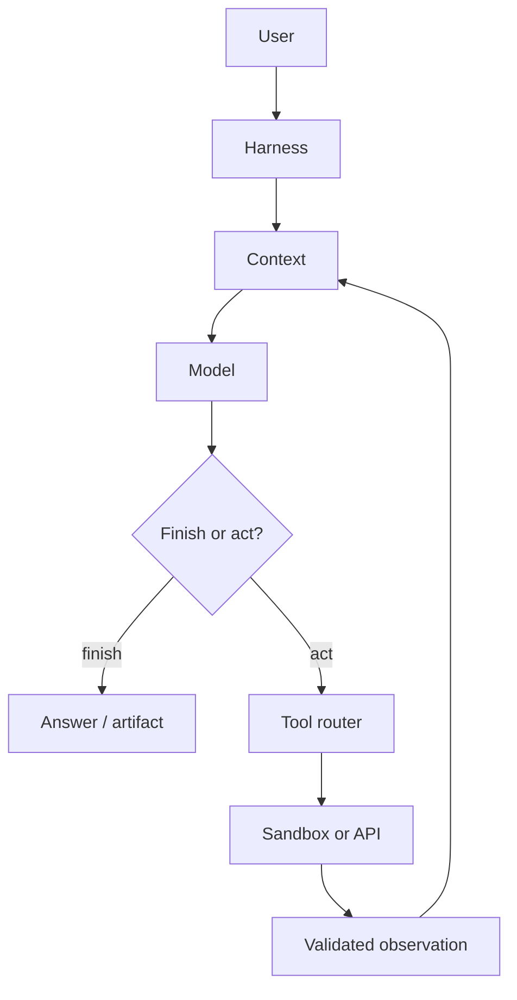

# Agents and harnesses

## Why the distinction matters

The model (the "brain") is only one component. Two teams can ship the same model with wildly different reliability, cost, and safety profiles depending on how they build the harness—the context manager, tool router, planner, retry logic, sandbox, and approval gates that surround it. Anthropic's production surveys found that the most successful agents use simple, composable harness patterns; the complexity lives in the runtime, not the prompt. Understanding where the agent loop ends and the harness begins lets you diagnose failures precisely: a wrong answer may be a prompt problem, but a dropped tool call, an un-retried timeout, or an un-sandboxed side effect is a harness problem.

The child notes below explore the trade-offs at each layer of this stack.

- [[02 Agents and Harnesses/What Is an Agent]] — The observe/decide/act loop: when autonomy helps, when deterministic workflows suffice, and how to evaluate the whole trajectory—not just the final answer.
- [[02 Agents and Harnesses/Agent Harness]] — The runtime machinery around the model: how context managers, tool registries, planners, and retry loops cooperate; thin-harness vs. framework design patterns.
- [[02 Agents and Harnesses/Sandboxes and Execution Planes]] — The policy/execution split: secret brokering, artifact promotion, and why policy must stay separate from execution.
- [[02 Agents and Harnesses/Planning State and Persistence]] — Durable execution: state schemas, checkpoint/replay/compensate recovery, idempotency keys, and backend choices (Temporal, Redis, DynamoDB).
- [[02 Agents and Harnesses/Computer-Use and Browser Agents]] — Grounded UI actions: Anthropic Computer Use, OpenAI CUA, DOM vs. screenshot pipelines, and why vision-driven browsing is expensive and fragile.
- [[02 Agents and Harnesses/Vision and Multimodal Input Engineering]] — Multimodal input: model capabilities, resolution/tiling strategies, OCR pipelines, video frame sampling, and cost management.
- [[02 Agents and Harnesses/Voice and Audio Agents]] — Real-time audio: OpenAI Realtime API, Deepgram STT, ElevenLabs TTS, Silero VAD, barge-in, and the ~300ms conversational latency budget.
- [[02 Agents and Harnesses/Sandboxing Infrastructure]] — Isolation technology choice: gVisor vs. Kata vs. Firecracker, cloud sandboxes (E2B, Modal), and escape-risk trade-offs.
- [[04 Workflows and Orchestration/Multi-Agent Systems]] — When one loop becomes a team: coordination, delegation, and multi-agent failure modes.

---

---

> **← [[01 Foundations/Fine-Tuning Decision Framework|Fine-Tuning Decision Framework]]** · **[[AI_Home|Home]]** · **[[02 Agents and Harnesses/What Is an Agent|What Is an Agent]] →**
