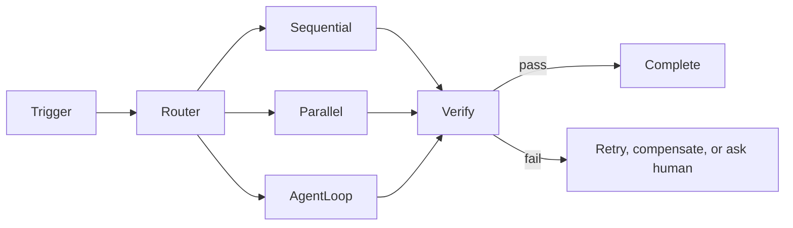

# Workflows and orchestration

## Plain-English introduction

When a smart assistant needs to do something complicated — like researching a topic, writing a report, and posting it — someone (or something) has to manage the steps, hand off work between parts, and make sure nothing gets lost along the way. Orchestration is that management layer. Think of it like a conductor leading an orchestra: individual musicians are talented, but without someone coordinating tempo and transitions, the performance falls apart. This note maps out the tools and ideas that turn a single clever AI loop into a reliable, inspectable system.

Orchestration is the discipline of decomposing a complex task into managed steps, routing decisions, tool calls, and human checkpoints — then making the whole pipeline inspectable, resumable, and governable. It is not a framework; it is the control plane that turns a clever agent loop into a production system.

## Framework mini-map

| Framework | Language | Best fit | Production readiness |
|---|---|---|---|
| **LangGraph** | Python | Complex workflows needing fine-grained graph control, durable state, human-in-the-loop. Nodes + edges with built-in persistence and LangGraph Studio. | High — v1.0 Oct 2025; Uber, LinkedIn, Klarna, JP Morgan, Cisco. |
| **CrewAI** | Python | Role-based multi-agent with defined roles, goals, and backstories. Two modes: Crews (model-driven) and Flows (event-driven, deterministic). | High — commercial AMP Cloud product. |
| **AutoGen / MS Agent Framework** | Python + .NET | AutoGen absorbed into Microsoft Agent Framework (merged with Semantic Kernel). Public preview Oct 2025, v1.0 Apr 2026. | High (new MS Framework), low (legacy AutoGen). |
| **OpenAI Agents SDK** | Python | Minimal-abstraction SDK. Primitives: Agents, Handoffs, Guardrails. Built-in tracing, sandbox, MCP integration. | High — first-party, actively maintained. |
| **Mastra** | TypeScript | TypeScript-first agents with Mastra Studio UI. Supports OpenAI, Anthropic, Google, xAI. | Moderate — newer ecosystem. |
| **Temporal** | Polyglot | Durable execution engine for long-running workflows. Journal every step before executing; engine replays on restart. Used by Stripe, Revolut, Wise. | High — battle-tested in financial systems. |

See [[04 Workflows and Orchestration/Workflow Patterns]] for topology selection and [[04 Workflows and Orchestration/Multi-Agent Systems]] for multi-agent coordination.

## Cost awareness across multi-step runs

Multi-step orchestration multiplies LLM cost. A single agent loop at 2k tokens per step across 10 steps is 20k tokens; a supervisor-worker system with 5 parallel subagents each spending 10k tokens hits 50k+ tokens per invocation. Budget controls: per-step and per-run token ceilings, max-retry limits, hard timeouts. Durable execution (Temporal, LangGraph checkpointing) avoids wasted spend by resuming from checkpoints rather than replaying entire runs.

## Error recovery

Agent workflows fail non-deterministically. Orchestration must handle: transient LLM API errors (exponential backoff with jitter, never retry 400/401/404), tool failures (circuit breaker to stop calling a failing service), state loss (checkpoint serialization at each step), and unbounded loops (hard cap ~5 iterations with escalation). Durable execution engines provide engine-guaranteed idempotency — the journal is the audit trail. For compensation when partial work has side effects, the saga pattern (compensating transactions) or durable execution (replay from journal) are standard approaches. See [[04 Workflows and Orchestration/Workflow Patterns]] § Error recovery for the detailed pattern catalog.

## Sources and further reading

- LangChain, LangGraph Overview — https://docs.langchain.com/oss/python/langgraph/overview — graph-based orchestration, durable state, v1.0 Oct 2025.
- CrewAI, Docs — https://docs.crewai.com/ — role-based multi-agent, Crews and Flows modes.
- AG2, Docs — https://docs.ag2.ai/ — AutoGen successor, absorbed into Microsoft Agent Framework.
- Mastra, Docs — https://mastra.ai/docs — TypeScript-first agent framework.
- OpenAI Agents SDK, Docs — https://openai.github.io/openai-agents-python/ — minimal-abstraction SDK with agents, handoffs, guardrails.
- Anthropic, "Building effective agents," Dec 2024 — https://www.anthropic.com/engineering/building-effective-agents — five canonical workflow patterns.
- Forasoft, "LangGraph vs CrewAI vs AutoGen," 2026 — https://www.forasoft.com/learn/ai-for-video-engineering/articles-ai/langgraph-vs-crewai-vs-autogen-agent-frameworks — framework comparison.
- Fernel.io, "Durable Execution vs. Saga Pattern," 2026 — https://fernel.io/insights/06-durable-execution-vs-saga — saga vs durable execution trade-offs.
- AI Agents Blog, "5 Patterns for Production Reliability," 2026 — https://aiagentsblog.com/blog/agent-error-recovery-patterns/ — error recovery patterns.

All links verified 2026-08-27.

---

---

> **← [[03 Context Knowledge Memory/Behavior and Communication Controls|Behavior and Communication Controls]]** · **[[AI_Home|Home]]** · **[[04 Workflows and Orchestration/Workflow Patterns|Workflow Patterns]] →**
